# Inventory Manager
## Database Documentation (Standalone)

**Purpose:** a complete, self-contained reference to the Inventory Manager data layer — data dictionary, entity relationship diagram, and physical schema notes — usable on its own by anyone who needs the data model without the full application-build context (the Method of Procedure covers that separately).

**Validated:** every table, constraint, and trigger in this document has been executed against a live PostgreSQL 16 instance, migrations `V1` through `V9`, run fresh from an empty database with zero errors, and the new mechanisms introduced in V6–V9 specifically exercised (not just asserted) — see §5.

**Migration inventory:** `V1__baseline_schema.sql`, `V2__auth_security_columns.sql`, `V3__purchase_orders.sql`, `V4__seed_reference_data.sql`, `V5__scope_field_visibility_rules_by_category.sql`, `V6__asset_display_name.sql`, `V7__inventory_staleness.sql`, `V8__plugin_confirmation_workflow.sql`, `V9__saved_report_definitions.sql`. 31 tables total.

---

## 1. Entity Relationship Diagram

```mermaid
erDiagram
    APP_USER ||--o{ USER_ROLE : "has"
    ROLE ||--o{ USER_ROLE : "assigned to"
    ROLE ||--o{ ROLE_PERMISSION : "grants"
    PERMISSION ||--o{ ROLE_PERMISSION : "granted by"
    APP_USER ||--o{ USER_PERMISSION_OVERRIDE : "has overrides"
    PERMISSION ||--o{ USER_PERMISSION_OVERRIDE : "overridden by"

    ASSET_CATEGORY ||--o{ CUSTOM_FIELD_DEFINITION : "defines"
    ASSET_CATEGORY ||--o{ LIFECYCLE_TRANSITION : "scopes"
    ASSET_CATEGORY ||--o{ WARRANTY_ALERT_THRESHOLD : "configures"
    LIFECYCLE_STATE ||--o{ LIFECYCLE_TRANSITION : "from/to"

    ASSET_CATEGORY ||--o{ ASSET : "classifies"
    LOCATION ||--o{ ASSET : "houses"
    LOCATION ||--o{ LOCATION : "parent of"
    LIFECYCLE_STATE ||--o{ ASSET : "current state"
    APP_USER ||--o{ ASSET : "assignee (optional)"
    APP_USER ||--o{ ASSET : "last_verified_by (optional)"
    CUSTOM_FIELD_DEFINITION ||--o{ FIELD_VISIBILITY_RULE : "gated by"
    PERMISSION ||--o{ FIELD_VISIBILITY_RULE : "requires"
    ASSET_CATEGORY ||--o{ FIELD_VISIBILITY_RULE : "optionally scopes"

    ASSET ||--o{ ASSET_RELATIONSHIP : "source"
    ASSET ||--o{ ASSET_RELATIONSHIP : "target"
    RELATIONSHIP_TYPE ||--o{ ASSET_RELATIONSHIP : "typed by"
    ASSET ||--o{ ATTACHMENT : "has"
    ASSET ||--o{ AUDIT_EVENT : "audited (loose ref)"

    APP_USER ||--o{ PURCHASE_ORDER : "requests"
    PURCHASE_ORDER ||--o{ PURCHASE_ORDER_LINE_ITEM : "contains"
    ASSET_CATEGORY ||--o{ PURCHASE_ORDER_LINE_ITEM : "ordered category"
    PURCHASE_ORDER ||--o{ PURCHASE_ORDER_RECEIPT : "received via"
    PURCHASE_ORDER_RECEIPT ||--o{ PURCHASE_ORDER_RECEIPT_LINE : "covers"
    PURCHASE_ORDER_LINE_ITEM ||--o{ PURCHASE_ORDER_RECEIPT_LINE : "received against"
    PURCHASE_ORDER ||--o{ ASSET : "arrived on (optional)"
    PURCHASE_ORDER_LINE_ITEM ||--o{ ASSET : "arrived on (optional)"

    NOTIFICATION_RULE ||--o{ DISTRIBUTION_TARGET : "notifies"
    ROLE ||--o{ DISTRIBUTION_TARGET : "role-based target"

    PLUGIN ||--o{ PLUGIN_SYNC_LOG : "runs produce"
    PLUGIN ||--o{ PLUGIN_ASSET_LINK : "settled decisions"
    PLUGIN ||--o{ PLUGIN_PENDING_ACTION : "proposes"
    ASSET ||--o{ PLUGIN_ASSET_LINK : "linked (optional)"
    ASSET ||--o{ PLUGIN_PENDING_ACTION : "matched (optional)"
    PLUGIN_SYNC_LOG ||--o{ PLUGIN_PENDING_ACTION : "produced by"
    PLUGIN ||--o{ LDAP_GROUP_ROLE_MAPPING : "maps groups"
    ROLE ||--o{ LDAP_GROUP_ROLE_MAPPING : "mapped to"

    APP_USER ||--o{ SAVED_REPORT_DEFINITION : "creates"
    APP_USER ||--o{ IMPORT_BATCH : "runs"
```

*(31 tables total; this diagram groups them by functional area — Identity/Access, Category Configuration, Asset Core, Relationships/Attachments/Audit, Purchase Orders, Notifications, Plugins, Reporting — rather than showing all 31 as one undifferentiated mass.)*

---

## 2. Data Dictionary

### 2.1 Identity & Access Control

**`app_user`** — every human account, regardless of auth provider.
| Column | Type | Null | Default | Notes |
|---|---|---|---|---|
| id | bigint | NO | identity | PK |
| username | text | NO | | unique |
| auth_provider | text | NO | | CHECK `LOCAL`/`LDAP`/`ACTIVE_DIRECTORY` |
| external_id | text | YES | | DN/provider ID; NULL for LOCAL |
| email | text | YES | | |
| password_hash | text | YES | | BCrypt cost 12; NULL unless LOCAL |
| failed_login_attempts | int | NO | 0 | Phase 6 lockout |
| locked_until | timestamptz | YES | | NULL = not locked |
| is_active | boolean | NO | true | |
| created_at / updated_at | timestamptz | NO | now() | |
| last_login_at | timestamptz | YES | | V2 |
| must_change_password | boolean | NO | false | V2 |

**`role`** (id, name unique) — 7 seeded: Administrator, Network Engineer, Asset Manager, Purchaser, Customer Service, Management, Unassigned.

**`permission`** (id, permission_key unique, description) — 24 seeded keys across Asset/Location/Relationship/PO/Configuration/Reporting/Import areas.

**`user_role`** (user_id, role_id) — composite PK, many-to-many.

**`role_permission`** (role_id, permission_id) — composite PK, many-to-many; this is the entire authorization mechanism — no hardcoded role checks anywhere.

**`user_permission_override`** — individual grant/deny, independent of role. `(id, user_id, permission_id, effect CHECK GRANT/DENY, created_by, created_at)`, unique on `(user_id, permission_id)`. DENY always wins over role-derived grants at the application layer.

### 2.2 Category-Scoped Configuration

**`asset_category`** — the classification governing custom fields, lifecycle, warranty, and (since V3/V7) serialization and staleness behavior.
| Column | Type | Null | Default | Notes |
|---|---|---|---|---|
| id | bigint | NO | identity | PK |
| name | text | NO | | unique |
| description | text | YES | | |
| created_at / updated_at | timestamptz | NO | now() | |
| is_serialized | boolean | NO | true | V3 — TRUE: one Asset row per unit received. FALSE: bulk, one row carries a quantity. |
| verification_interval_days | int | YES | | V7 — NULL disables staleness checking for this category |

**`custom_field_definition`** — category-scoped custom fields (JSONB-backed on `asset`, not EAV). `(id, asset_category_id, field_name, field_type CHECK TEXT/NUMBER/DATE/BOOLEAN/ENUM, is_required, sort_order, enum_options TEXT[])`, unique on `(asset_category_id, field_name)`.

**`lifecycle_state`** — shared vocabulary (`Ordered`, `Received`, `QA`, `Available`, `Reserved`, `Installed`, `Active`, `Repair`, `Returned`, `Retired`, `Disposed`).

**`lifecycle_transition`** — the directed graph, per category. `(id, asset_category_id, from_state_id, to_state_id)`, unique on the triple, CHECK `from_state_id <> to_state_id`. Three distinct graph shapes are seeded: standard serialized equipment, Vehicle (no "Installed"), and bulk/non-serialized (no QA/Repair).

**`warranty_alert_threshold`** — `(id, asset_category_id, days_before_expiration)`, unique on the pair.

**`field_visibility_rule`** — the single mechanism gating both core columns and custom fields.
| Column | Type | Null | Notes |
|---|---|---|---|
| id | bigint | NO | PK |
| entity_type | text | NO | CHECK `ASSET` / `PURCHASE_ORDER_LINE_ITEM` |
| core_field_name | text | YES | populated for a core column rule |
| custom_field_definition_id | bigint | YES | populated for a custom-field rule; exactly one of these two is set |
| required_permission_id | bigint | NO | |
| asset_category_id | bigint | YES | **V5** — NULL = applies globally wherever the field exists; populated = scoped to one category only |

### 2.3 Location & Asset Core

**`location`** — self-referencing hierarchy. `(id, parent_location_id, name, location_type CHECK 10 values, address_line1, city, state, zip, ownership_type CHECK 4 values, is_active, created_at, updated_at)`.

**`asset`** — the universal core table (43 columns). No per-category tables exist; category-specific behavior is entirely data-driven via `asset_category`/`custom_field_definition`/`lifecycle_transition`.

| Group | Columns |
|---|---|
| Identity/classification | `asset_category_id`, `location_id`, `lifecycle_state_id` |
| Physical/network identity | `manufacturer`, `model`, `serial_number`, `asset_tag`, `mac_addresses TEXT[]`, `management_ip INET`, `hostname`, `firmware_version`, `software_version`, `device_role` |
| **`name`** | **V6** — human-friendly display label, distinct from `hostname`/`asset_tag` |
| Purchase/warranty | `purchase_date`, `purchase_price NUMERIC(12,2)`, `vendor`, `purchase_link`, `invoice_number`, `warranty_start`, `warranty_expiration`, `license_information` |
| Descriptive | `condition`, `status`, `customer_name`, `customer_address`, `notes` |
| Assignee (core, cross-category) | `assignee_type CHECK NONE/FREE_TEXT/USER`, `assignee_text`, `assignee_user_id` — CHECK enforces exactly one representation matches `assignee_type` |
| Custom fields | `custom_fields JSONB DEFAULT '{}'` — GIN-indexed (`jsonb_path_ops`) |
| Concurrency/soft-delete | `version INT` (optimistic locking), `is_deleted`, `deleted_at` |
| Bookkeeping | `created_at`, `updated_at`, `search_vector TSVECTOR` |
| PO traceability (V3) | `quantity INT CHECK > 0` (always 1 for serialized categories), `purchase_order_id`, `purchase_order_line_item_id` |
| **Staleness (V7)** | **`last_verified_at TIMESTAMPTZ NOT NULL DEFAULT now()`**, **`last_verified_by`** |

**`asset_relationship`** — `(id, source_asset_id, target_asset_id, relationship_type_id, created_at)`, unique on the triple, CHECK `source_asset_id <> target_asset_id`.

**`relationship_type`** — `(id, name unique)`.

**`attachment`** — `(id, asset_id, file_path, file_category CHECK 9 values, original_filename, uploaded_by, uploaded_at)`.

**`audit_event`** — the single append-only audit mechanism for Asset/Location/Relationship/PurchaseOrder. `(id, entity_type, entity_id, user_id, occurred_at, action, field_name, previous_value, new_value, reason)`. **`entity_id` is deliberately not a formal FK** — audit must outlive a hard-deleted source row. `user_id` is nullable — used for plugin-driven system changes (Phase 8 §9), which populate `reason` instead (e.g. *"Synced by plugin: NetBox"*).

### 2.4 Purchase Orders

**`purchase_order`** — single entity spanning the full request→order→receive lifecycle (not split Request/Order tables). `status CHECK` 7 values (`DRAFT`→…→`RECEIVED`/`CANCELLED`/`REJECTED`), plus two CHECKs enforcing that order-specific fields are only required once actually ordered, and rejection fields only required once actually rejected.

**`purchase_order_line_item`** — `quantity_ordered`, `quantity_received` (denormalized running total, trigger-maintained), `unit_price NUMERIC(12,2)`, CHECK `quantity_received <= quantity_ordered`.

**`purchase_order_receipt`** / **`purchase_order_receipt_line`** — receiving modeled as discrete events (not a running total edited in place), letting different people receive different partial shipments of the same order, each independently timestamped.

### 2.5 Notifications

**`notification_rule`** — `(id, name, trigger_type CHECK, asset_category_id nullable, is_active)`. `trigger_type` has been widened twice: originally `WARRANTY_EXPIRATION` only (V1), then `+ PURCHASE_ORDER_SUBMITTED` (V3), then `+ INVENTORY_STALENESS_CHECK` (V7).

**`distribution_target`** — `(id, notification_rule_id, target_type CHECK EMAIL/ROLE, email_address, role_id)`, CHECK enforcing exactly one of email/role is populated per target type. Role-based targets resolve dynamically at send time — never a stale snapshot.

### 2.6 Plugin Framework

**`plugin`** — `(id, name unique, plugin_type CHECK 5 values, configuration JSONB, is_enabled, last_sync_at, last_sync_status)`.

**`plugin_sync_log`** — `(id, plugin_id, started_at, finished_at, status CHECK PENDING-style RUNNING/SUCCESS/PARTIAL/FAILURE, message, records_created, records_updated, records_failed)`. The three counter columns are **V8**.

**`plugin_asset_link`** — **V8**. The settled disposition per `(plugin_id, external_identifier)`: either `LINKED` (trusted, asset_id populated) or `IGNORED` (permanently skipped, asset_id NULL). CHECK enforces the pairing; unique on `(plugin_id, external_identifier)`.

**`plugin_pending_action`** — **V8**. The staging table for proposals awaiting human review: `action_type CHECK LINK_EXISTING_ASSET/CREATE_NEW_ASSET`, `matched_asset_id` (required for the former, forbidden for the latter, CHECK-enforced), `proposed_data JSONB`, `status CHECK PENDING/ACCEPTED/DENIED`, reviewer tracking.

**`ldap_group_role_mapping`** — `(id, plugin_id, group_identifier, role_id)`, unique on the triple. Maps a directory group to a platform Role; evaluated at login and on each subsequent login. This is the *only* piece of the Plugin Framework that touches authorization, and it never touches `app_user.password_hash`/`locked_until` (Phase 6/8 boundary).

### 2.7 Bulk Import & Reporting

**`import_batch`** — `(id, filename, imported_by, imported_at, row_count, success_count, failure_count, status CHECK PENDING/VALIDATED/COMMITTED/FAILED)`.

**`saved_report_definition`** — **V9**. `(id, name, created_by, entity_type CHECK ASSET/PURCHASE_ORDER, selected_fields JSONB, filter_config JSONB, created_at)`. Purely a convenience layer — the ad hoc custom report builder never requires one of these to exist.

---

## 3. Triggers & Functions (all validated live)

| Trigger | Table | Timing/Event | Function | Purpose |
|---|---|---|---|---|
| `trg_app_user_updated_at` | `app_user` | BEFORE UPDATE | `set_updated_at()` | Maintains `updated_at` |
| `trg_asset_category_updated_at` | `asset_category` | BEFORE UPDATE | `set_updated_at()` | Maintains `updated_at` |
| `trg_location_updated_at` | `location` | BEFORE UPDATE | `set_updated_at()` | Maintains `updated_at` |
| `trg_purchase_order_updated_at` | `purchase_order` | BEFORE UPDATE | `set_updated_at()` | Maintains `updated_at` |
| `trg_asset_updated_at` | `asset` | BEFORE UPDATE | `set_updated_at()` | Maintains `updated_at` |
| `trg_asset_search_vector` | `asset` | BEFORE INSERT/UPDATE | `asset_search_vector_update()` | Maintains the weighted `tsvector` across serial/tag/hostname/**name**/manufacturer/model/vendor/invoice/customer/notes/custom_fields |
| `trg_asset_bump_last_verified_on_quantity_change` | `asset` | BEFORE UPDATE | `asset_bump_last_verified_on_quantity_change()` | **V7** — stamps `last_verified_at = now()` whenever `quantity` actually changes; leaves it untouched for any other field edit |
| `trg_apply_po_receipt_line` | `purchase_order_receipt_line` | AFTER INSERT | `apply_po_receipt_line()` | Increments the parent line item's `quantity_received`; **rejects** (raises exception) any receipt that would exceed `quantity_ordered` |
| `trg_recompute_po_status` | `purchase_order_line_item` | AFTER UPDATE OF `quantity_received` | `recompute_po_status()` | Recomputes the parent PO's status to `PARTIALLY_RECEIVED`/`RECEIVED`; never overrides `DRAFT`/`SUBMITTED`/`REJECTED`/`CANCELLED` |

All nine were re-confirmed working correctly on the final V1–V9 validation pass (§5), including the two added since the original Phase 5/7 validation (`trg_asset_bump_last_verified_on_quantity_change`, and the search-vector trigger's extension to include `name`).

---

## 4. Indexing Strategy

- **Full-text search:** `idx_asset_search_vector` (GIN on `search_vector`) — no Elasticsearch; native Postgres `tsvector` + weighted ranking (A: serial/tag/hostname/name, B: manufacturer/model/vendor/invoice, C: customer name, D: notes/custom fields).
- **Fuzzy/partial matching:** `pg_trgm` GIN indexes on `hostname`, `serial_number`, and (V6) `name`.
- **Custom field search:** `idx_asset_custom_fields_gin` (GIN, `jsonb_path_ops`) — custom-field search never needs a second search system.
- **Partial indexes** throughout on `is_deleted = FALSE` / `NOT NULL` conditions (e.g. `idx_asset_category`, `uq_asset_serial`, `idx_asset_last_verified_at`) — keeps indexes small and relevant rather than indexing soft-deleted or absent data.
- **Uniqueness as data integrity**, not just performance: `uq_asset_serial` (partial unique, excludes soft-deleted/NULL), `field_visibility_rule` implicit uniqueness via its CHECK, `plugin_asset_link (plugin_id, external_identifier)`, and others noted in §2.

---

## 5. Validation Record

The full `V1` through `V9` chain was executed against a live PostgreSQL 16 instance, from a completely empty database, with zero errors. Beyond "it ran," the following behaviors were specifically exercised with real data (not just asserted):

- **Role/permission catalog:** all 7 roles' permission counts confirmed exactly matching the design (Administrator 24, Network Engineer 11, Asset Manager 18, Purchaser 8, Customer Service 3, Management 9, Unassigned 0).
- **Field visibility, category-scoped (V5):** a Laptop and a Vehicle asset with an identical `assignee_user_id` value — confirmed visible on the Laptop, gated on the Vehicle, with all pre-existing global rules (cost fields, VIN, PO unit price) unaffected.
- **Assignee mutual-exclusivity CHECK:** confirmed rejects an invalid `FREE_TEXT` + `assignee_user_id` combination.
- **PO receiving trigger:** a valid partial receipt correctly updates status to `PARTIALLY_RECEIVED`; a subsequent over-receipt attempt on the same line item is correctly rejected with the exact designed error message.
- **Staleness trigger (V7):** confirmed a fresh asset is stamped `last_verified_at` at creation (not NULL); confirmed an edit to `notes` does **not** bump it; confirmed a `quantity` change **does**.
- **Plugin confirmation workflow (V8):** staged one `LINK_EXISTING_ASSET` and one `CREATE_NEW_ASSET` pending action; accepted the first (correctly produced a `LINKED` `plugin_asset_link` row); permanently ignored the second (correctly produced an `IGNORED` row with `asset_id` NULL); confirmed the CHECK constraint rejects an invalid `LINKED` row with a NULL `asset_id`; confirmed reversal (deleting the `IGNORED` row) works as a plain one-row delete, leaving the record eligible for normal matching again.
- **SFP/Transceiver starter category (V8):** confirmed seeded as `is_serialized = TRUE` with its five custom fields and the standard serialized-equipment lifecycle graph.
- **Regression:** role/permission counts and `field_visibility_rule` row count re-confirmed unchanged after V6–V9, proving the new migrations didn't disturb anything established in V1–V5.

This document reflects the schema exactly as validated, not as originally drafted — the one fix made mid-validation (giving `asset.last_verified_at` a `NOT NULL DEFAULT now()` instead of leaving it nullable with an assumed application-layer default) is already incorporated into `V7` as shown above, precisely because this document's standard is "what was proven to work," not "what was first written."
